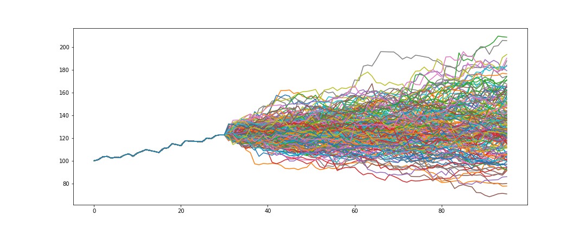

# What is this repo?

Monte Carlo methods are widely used in finance for various purposes, primarily relying on simulations of asset returns. However, the quality of these simulations can vary significantly based on the method used.

For example, consider generating a simulation for AAPL:

- Sampling from a Normal Distribution
  - Pros: Fast and computationally efficient.
  - Cons: Inaccurate because real asset returns are not normally distributed, and volatility is not constant over time.
  
- Sampling from a Fatter-Tailed Distribution (e.g., stable or t-distribution):
  - Pros: Accounts for extreme events better than normal distribution.
  - Cons: Still assumes constant volatility, which is unrealistic.

- Using a Stochastic Volatility Process (e.g., Ornstein-Uhlenbeck process):

  - Pros: Models changing volatility more accurately.
  - Cons: Difficult to tune, assumes constant autocorrelation of volatility, which does not hold in reality.

Now, imagine AAPL goes through significant events such as an earnings presentation, a product keynote, or a macroeconomic release. These events are typically associated with high variance in returns (e.g., earnings beats/misses or product hype/disappointment). Traditional Monte Carlo methods cannot easily incorporate this information, yet it is crucial for accurate simulations, especially in path-dependent scenarios like American option pricing or hedging.

Transformers are the solution to that.

## Why Transformers?
As mentioned in the previous section, we can encode known variances and use them in order to create a more faithful simulation. Transformers excel in this task because not only they can handle well the high variance event, but also the previous and the following days.

## Results
In the notebook you can find the several experiments that I conducted. Some caveats that have to be mentioned:
- The dataset provided is a matrix of returns of 10 assets, adjusted for dividends and splits. This dataset is very small (75K tokens) and introduces a significant bias to the model. A bigger dataset, free of survivorship bias, is needed in order to build a more robust model.
- The current model is sensitive to the generation hyperparameters, specifically the temperature and the top_k, which means that the simulations only make sense for a range of hyperparameters. A bigger and less biased dataset is likely to fix this issue as well (or at least make the range wider).
- I've considered known high variance events as days where the return is <>3% from the mean. This is probably ok in big companies, but I think it would not hold true in small caps. A better approach would be to use a dataset of economic releases combined with earnings calendars.
- The best way I've found to analyze the quality of the simulations is to check how many of the high variance encoded days are present in the top high variance days in the simulations. For example, for a simulation of 100 days that contain 5 high variance days, those 5 days should be on the top 10 highest variance days of the simulation.

Note: Part of the train setup, together with some helper functions are based on Karpathy's [NanoGPT](https://github.com/karpathy/nanoGPT/tree/master).

